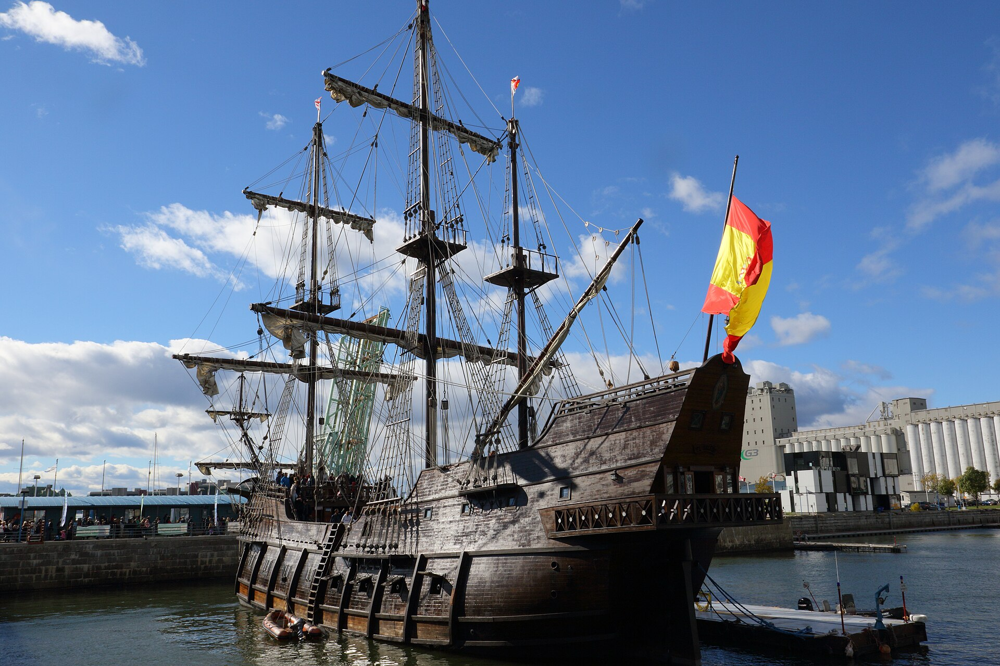
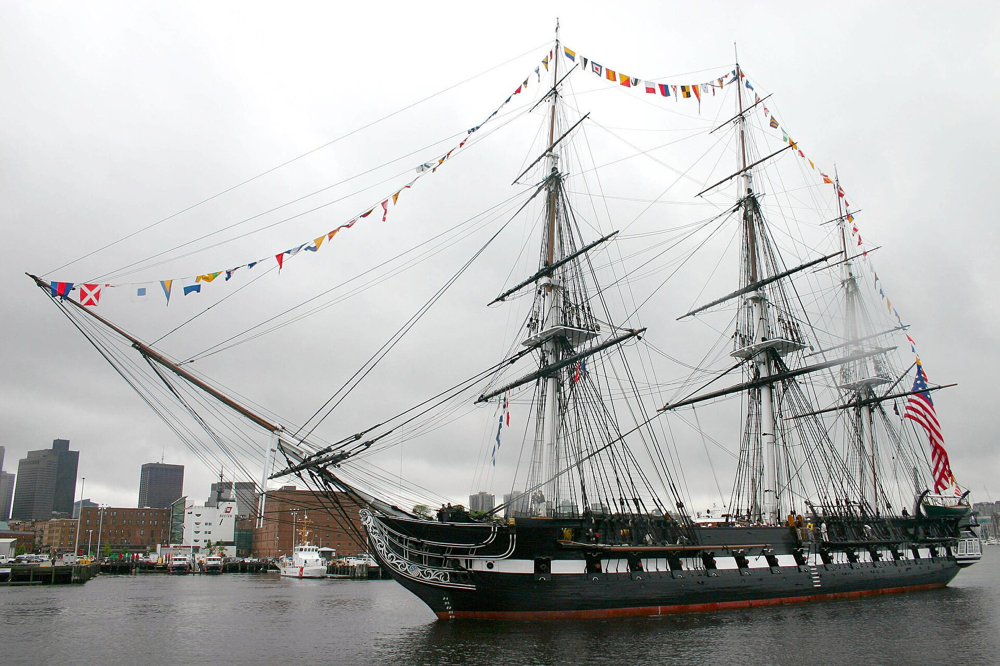
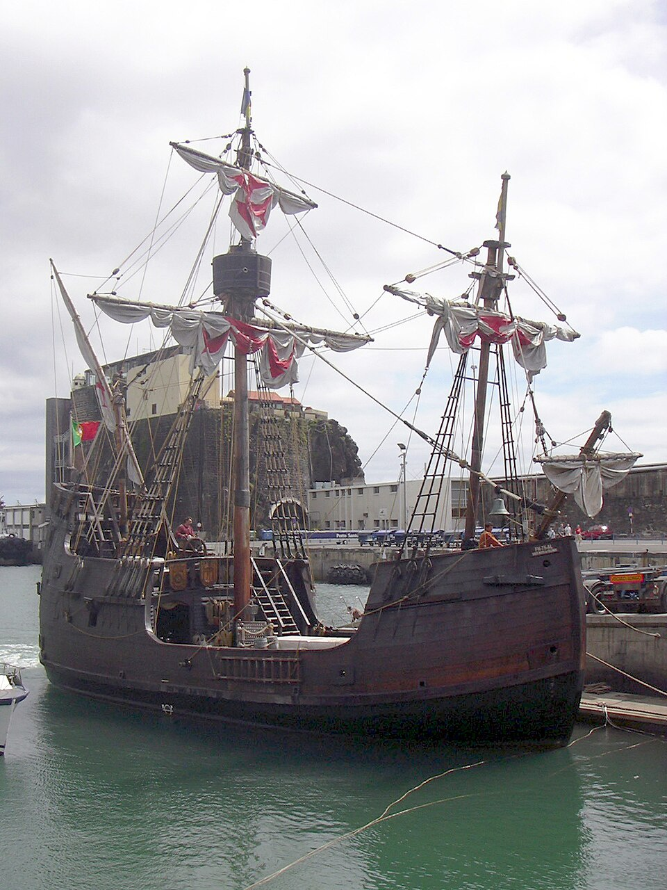
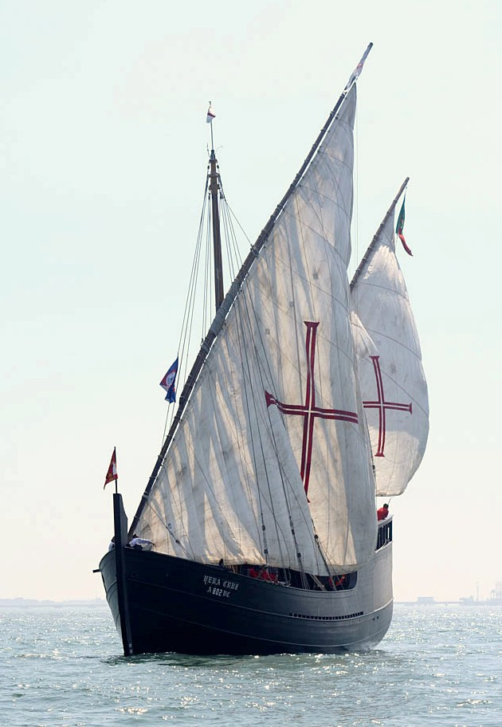
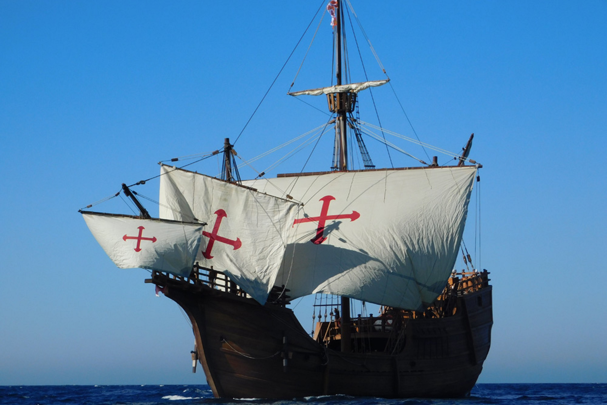

Nós somos o grupo que fez fork inicialmente e por isso não temos os commits relacionados ao ReadMe registados neste repositório.

# Rapazes

**Curso:** Licenciatura em Engenharia Informática (LEI)

| Número | Nome | Curso |
| :---: | :--- | :---: |
| 129838 | José Romeiro | LEI |
| 129847 | Rodrigo Leal | LEI |
| 129840 | Diogo Teixeira | LEI |
| 129827 | Miguel Antão | LEI |

---

# Tipos de Navios

|   Batalha Naval    | Descobrimentos | English | Dimensao | #Navios |
|:------------------:|:--------------:|:-------:|:--------:|:-------:|
|    Porta-aviões    |     Galeão     | Galleon |    5     |    1    |
| Navio de 4 canhões |    Fragata     | Frigate |    4     |    1    |
| Navio de 3 canhões |      Nau       | Carrack |    3     |    2    |
| Navio de 2 canhões |    Caravela    | Caravel |    2     |    3    |
|     Submarino      |     Barca      |  Barge  |    1     |    4    |

---

## História das embarcações

- [Galeão](https://pt.wikipedia.org/wiki/Gale%C3%A3o)

  

- [Fragata](https://pt.wikipedia.org/wiki/Fragata)

  

- [Nau](https://pt.wikipedia.org/wiki/Nau)

  

- [Caravela](https://pt.wikipedia.org/wiki/Caravela)

  

- [Barca](https://pt.wikipedia.org/wiki/Barca)

  

---

### Regras
* **Turnos:** Os jogadores jogam alternadamente.
* **Jogadas:** Em cada turno, um jogador atira 3 tiros sobre a frota adversária, referindo as respetivas coordenadas (Linha, Coluna).
* **Resultado das jogadas:** O adversário deve referir o resultado da jogada, após os 3 tiros, mencionado se algum tiro atingiu um navio, ou mais, (incluindo o tipo de navio alvejado) ou se acertou no mar.
* **Resultado:** Os jogadores devem registar, na grelha do oponente, os resultados dos sues tiros, identificando os navios afundados.

### Vencedor
* O primeiro jogador a atingir e afundar os 11 navios da frota inimiga ganha.
